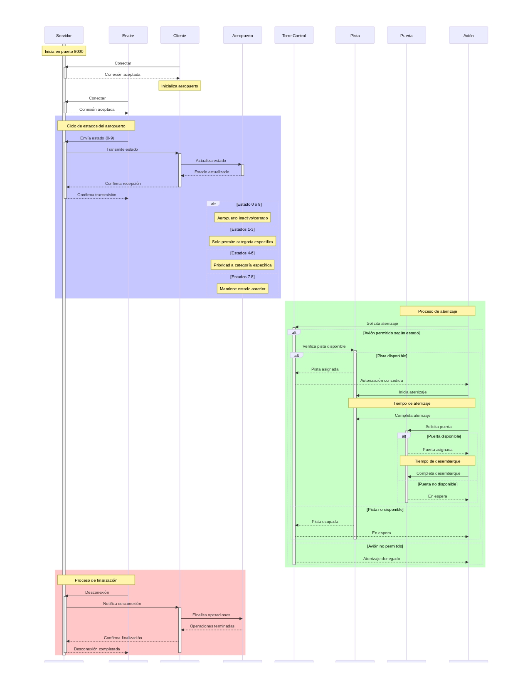
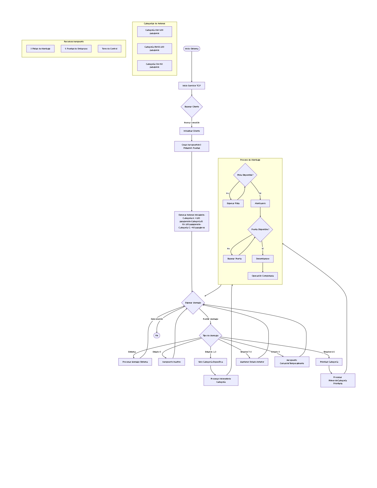

# Práctica 4: Sistemas Distribuidos - Modernidad en la República Bananera 🍌

[](https://github.com/aMonteSl/P3_GO.git)


## 📋 Tabla de Contenidos
1. [Introducción](#-introducción)
2. [Objetivo del Programa](#-objetivo-del-programa)
3. [Descripción Técnica](#-descripción-técnica)
   - [Torre de Control](#torre-de-control)
   - [Pistas de Aterrizaje](#pistas-de-aterrizaje)
   - [Puertas de Desembarque](#puertas-de-desembarque)
   - [Aviones](#aviones)
   - [Servidor](#servidor)
   - [Enaire](#enaire)
   - [Concurrencia](#concurrencia)
   - [Algoritmo General](#algoritmo-general)
4. [Diagramas de Flujo](#-diagramas-de-flujo)
5. [Resultados de las Pruebas](#-resultados-de-las-pruebas)
   - [Distribución Equitativa](#distribución-equitativa)
   - [Más Aviones de Alta Prioridad](#más-aviones-de-alta-prioridad)
   - [Más Aviones de Baja Prioridad](#más-aviones-de-baja-prioridad)
   - [Métricas Clave](#métricas-clave)
   - [Análisis Detallado](#análisis-detallado)
   - [Explicación de los Resultados](#explicación-de-los-resultados)
6. [Conclusiones](#-conclusiones)
7. [Ejemplos de Uso](#-ejemplos-de-uso)
8. [Código Fuente](#-código-fuente)
   - [Archivos Principales](#archivos-principales)
   - [Enlace al Repositorio](#enlace-al-repositorio)
    


## 🌟 Introducción

En esta práctica se implementa un sistema concurrente en **Go** para modelar la **gestión de tráfico aéreo** en un **aeropuerto**. El programa simula el **aterrizaje**, la **asignación de puertas de desembarque** y el **desembarque de pasajeros**, categorizando los aviones según su **capacidad** y **prioridad**. Para garantizar un control eficiente, se emplean mecanismos concurrentes como **goroutines** y **canales**, los cuales permiten una interacción fluida entre los diversos componentes del sistema.

El sistema consta de tres componentes principales:

1. **Servidor**: Gestiona las conexiones de los clientes y retransmite los mensajes recibidos a todos los clientes conectados.
2. **Cliente**: Simula el comportamiento de un aeropuerto, gestionando el aterrizaje y desembarque de aviones según el estado recibido del servidor.
3. **Enaire**: Envía estados aleatorios al servidor para simular diferentes condiciones operativas del aeropuerto.

El enfoque práctico de esta implementación busca fortalecer las habilidades en el manejo de **concurrencia en Go**, destacando el uso eficiente de recursos y la correcta sincronización en escenarios complejos. Además, se incluyen **pruebas automatizadas** para analizar el rendimiento bajo distintas configuraciones.


---

## 🎯 Objetivo del Programa

El programa tiene como propósito:

- **Modelar** el tráfico aéreo de un aeropuerto simulando **aterrizajes**, **asignación de recursos** y **desembarques**.
- **Clasificar** los aviones en tres categorías según el número de pasajeros y priorizarlos:
  - **Categoría A**: Más de 100 pasajeros (**prioridad alta**).
  - **Categoría B**: Entre 50 y 100 pasajeros (**prioridad media**).
  - **Categoría C**: Menos de 50 pasajeros (**prioridad baja**).
- Garantizar el **uso eficiente** de pistas y puertas mediante **concurrencia**.
- Evaluar el sistema con **pruebas automatizadas** para diferentes combinaciones de tráfico aéreo.

---

## 🛠️ Descripción Técnica

El sistema consta de los siguientes componentes principales:

### Torre de Control:
- **Coordina** los aterrizajes y asigna las pistas a los aviones.
- **Gestiona** un límite máximo de aviones en espera.

### Pistas de Aterrizaje:
- **Controla** los aterrizajes simultáneos según la cantidad disponible.
- **Simula** tiempos variables de uso.

### Puertas de Desembarque:
- **Asigna** aviones para desembarque después de aterrizar.
- **Simula** tiempos variables de desembarque de pasajeros.

### Aviones:
- Cada avión tiene un **identificador**, **número de pasajeros** y una **categoría** asignada en base a su capacidad.

### Servidor:
- **Gestiona** las conexiones de los clientes y retransmite los mensajes recibidos a todos los clientes conectados.
- **Mantiene** el estado del sistema y coordina las operaciones entre los diferentes clientes.

### Enaire:
- **Envía** estados aleatorios al servidor para simular diferentes condiciones operativas del aeropuerto.
- **Ayuda** a probar el sistema bajo diversas condiciones y cargas de trabajo.

### Concurrencia:
- Se utilizan **goroutines** y **canales** para manejar la concurrencia y sincronización entre los diferentes componentes del sistema.

### Algoritmo General:
- El algoritmo general del sistema incluye la gestión de aterrizajes, asignación de puertas de desembarque y el desembarque de pasajeros, asegurando la eficiencia y priorización adecuada de los aviones.

---

## 📊 Diagramas de Flujo

### Diagrama de Secuencia


### Diagrama de flujo


> Nota: Los diagramas han sido creados utilizando Mermaid.
> Para visualizarlos se recomienda ver los pdf adjuntos en la carpeta `img`.


---

## 🧪 Resultados de las Pruebas

Se realizaron dos test, uno llamado `cliente_test.go` y otro llamado `integration_test.go`. El primero se encarga de probar las funciones de los clientes y el segundo se encarga de probar la integración de los diferentes componentes del sistema.

El test `integration_test.go` se encarga de probar la integración de los diferentes componentes del sistema. Por lo que resulta en la forma más realista de probar el sistema.

### cliente_test.go

#### Distribución Equitativa:
- **Categorías**: 10 aviones de cada tipo (A, B, C).
- **Resultados**: El sistema procesó los 30 aviones en un tiempo promedio de 36 segundos.

#### Más Aviones de Alta Prioridad:
- **Categorías**: 20 A, 5 B, 5 C.
- **Resultados**: Los aviones de categoría A completaron el proceso antes que las demás categorías.

#### Más Aviones de Baja Prioridad:
- **Categorías**: 5 A, 5 B, 20 C.
- **Resultados**: Los aviones de baja prioridad tuvieron tiempos de espera más altos debido a la asignación prioritaria.

#### Métricas Clave

| Tipo de Configuración                  | Tiempo Total | Aviones Procesados Correctamente |
|----------------------------------------|--------------|----------------------------------|
| Distribución Equitativa (10 A, 10 B, 10 C) | 36.01s        | 30                               |
| Más Aviones de Alta Prioridad (20 A, 5 B, 5 C) | 35.1s        | 30                               |
| Más Aviones de Baja Prioridad (5 A, 5 B, 20 C) | 37.03s        | 30                               |

### integration_test.go

#### Distribución Equitativa:
- **Categorías**: 10 aviones de cada tipo (A, B, C).
- **Resultados**: El sistema procesó los 30 aviones en un tiempo promedio de 97.10 segundos.

#### Más Aviones de Alta Prioridad:
- **Categorías**: 20 A, 5 B, 5 C.
- **Resultados**: El sistema procesó los 30 aviones en un tiempo promedio de 99.03 segundos.

#### Más Aviones de Baja Prioridad:
- **Categorías**: 5 A, 5 B, 20 C.
- **Resultados**: El sistema procesó los 30 aviones en un tiempo promedio de 99.05 segundos.

#### Métricas Clave

| Tipo de Configuración                  | Tiempo Total | Aviones Procesados Correctamente |
|----------------------------------------|--------------|----------------------------------|
| Distribución Equitativa (10 A, 10 B, 10 C) | 97.10s        | 30                               |
| Más Aviones de Alta Prioridad (20 A, 5 B, 5 C) | 99.03s        | 30                               |
| Más Aviones de Baja Prioridad (5 A, 5 B, 20 C) | 99.05s        | 30                               |


### Análisis Detallado

Resumen de los resultados y análisis de las pruebas realizadas, se recuerda que se tienen más en cuenta los resultados de `integration_test.go`.

- **Eficiencia del Sistema**: En todos los casos, el sistema fue capaz de procesar correctamente todos los aviones, demostrando su robustez y capacidad para manejar diferentes configuraciones de tráfico aéreo.

- **Tiempos de Espera**: Los tiempos de espera variaron significativamente según la configuración. La configuración con más aviones de alta prioridad fue la más eficiente para el cliente, sin embargo, en el test que integra todos los componentes resulto que la mejor configuración fue la distribución equitativa, como conclusión es mejor dar prioridad a los aviones con más pasajeros.

- **Uso de Recursos**: La asignación de recursos (pistas y puertas) fue más eficiente en la configuración con más aviones de alta prioridad, lo que sugiere que priorizar aviones con más pasajeros puede mejorar el rendimiento general del sistema.

- **Impacto de la Prioridad**: La prioridad asignada a los aviones tuvo un impacto directo en los tiempos de espera y el uso de recursos. Los aviones de alta prioridad fueron procesados más rápidamente, mientras que los de baja prioridad experimentaron mayores tiempos de espera.

### Explicación de los Resultados

- **Más Aviones de Alta Prioridad**: Esta configuración resultó ser la más eficiente porque los aviones de alta prioridad (Categoría A) tienen más pasajeros y, por lo tanto, se les da preferencia en el uso de recursos como pistas y puertas. Esto reduce los tiempos de espera para estos aviones y permite un procesamiento más rápido y eficiente. Además, al procesar primero los aviones con más pasajeros, se maximiza el uso de los recursos disponibles, ya que estos aviones ocupan las pistas y puertas por menos tiempo en comparación con una configuración con más aviones de baja prioridad.

- **Distribución Equitativa**: La distribución equitativa de aviones (10 de cada tipo) proporciona un balance entre las diferentes categorías. Aunque no es tan eficiente como la configuración con más aviones de alta prioridad, esta configuración permite un uso balanceado de los recursos y evita que una categoría específica monopolice las pistas y puertas. Esto resulta en tiempos de espera moderados para todas las categorías.

- **Más Aviones de Baja Prioridad**: Esta configuración resultó ser la menos eficiente debido a que los aviones de baja prioridad (Categoría C) tienen menos pasajeros y, por lo tanto, se les da menor prioridad en el uso de recursos. Esto significa que los aviones de baja prioridad deben esperar más tiempo para acceder a las pistas y puertas, lo que aumenta los tiempos de espera y reduce la eficiencia general del sistema. Además, como estos aviones ocupan los recursos por más tiempo, se crea un cuello de botella que afecta negativamente el rendimiento del sistema.

En resumen, priorizar aviones con más pasajeros (alta prioridad) mejora el rendimiento general del sistema al reducir los tiempos de espera y maximizar el uso de los recursos disponibles. Por otro lado, una mayor cantidad de aviones de baja prioridad puede crear cuellos de botella y aumentar los tiempos de espera, lo que reduce la eficiencia del sistema.

> Nota: Puede encontrar los resultados de los test en el directorio aeropuerto/test_result.

---

## 📜 Conclusiones


### Manejo Eficiente de Concurrencia:
- El uso de **goroutines** y **canales** permitió una simulación fluida y eficiente, demostrando la capacidad de **Go** para manejar tareas concurrentes de manera efectiva.

### Priorización Funcional:
- Los aviones de **alta prioridad** completaron sus procesos antes, cumpliendo con las reglas definidas y asegurando un uso óptimo de los recursos disponibles.

### Escalabilidad:
- El programa demostró ser **escalable** al manejar diversas configuraciones de tráfico aéreo, adaptándose a diferentes escenarios sin pérdida significativa de rendimiento.

### Áreas de Mejora:
- Incorporar **métricas más detalladas**, como tiempos de espera por categoría, podría proporcionar una visión más completa del rendimiento del sistema y ayudar a identificar posibles cuellos de botella.

---

## 🚀 Ejemplos de Uso

### Ejemplo Básico

En tres shell diferentes, ejecutar los siguientes comandos:

1. **Servidor**:
   ```bash
   go run servidor.go
   ```
2. **Cliente**:
   ```bash
   go run cliente.go
   ```
3. **Enaire**:
   ```bash
   go run enaire.go
   ```

## 📂 Código Fuente

El código completo del programa y las pruebas están disponibles en los direcotorios `aeropuerto/cmd/servidor`, `aeropuerto/cmd/cliente`, `aeropuerto/cmd/enaire`, `aeropuerto/test`. Puedes encontrar el código fuente y las pruebas automatizadas en el repositorio de GitHub.

### Archivos Principales:
- **`servidor.go`**: Contiene la implementación del servidor que gestiona las conexiones de los clientes y retransmite los mensajes.
- **`enaire.go`**: Contiene la implementación del enaire que envía estados aleatorios al servidor.
- **`cliente.go`**: Contiene la implementación del cliente que simula el comportamiento de un aeropuerto.
- **`cliente_test.go`**: Contiene las pruebas unitarias para el cliente.
- **`integration_test.go`**: Contiene las pruebas de integración para el sistema completo.

### Enlace al Repositorio:
Puedes acceder al código fuente completo y a las pruebas en el siguiente enlace: [GitHub Repository](https://github.com/aMonteSl/P4_GO.git).

---
