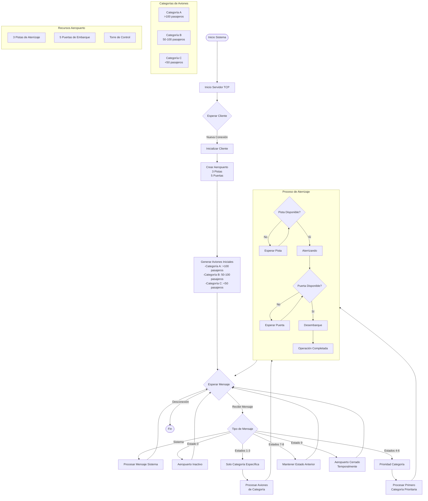

```mermaid
flowchart TB
    %% Definición de estilos
    classDef state fill:#f9f,stroke:#333,stroke-width:2px
    classDef process fill:#bbf,stroke:#333,stroke-width:2px
    classDef decision fill:#fdd,stroke:#333,stroke-width:2px
    
    %% Inicio del sistema
    Start([Inicio Sistema]) --> ServerStart[Inicio Servidor TCP]
    ServerStart --> WaitClient{Esperar Cliente}
    
    %% Conexión Cliente
    WaitClient --> |Nueva Conexión| InitClient[Inicializar Cliente]
    InitClient --> CreateAirport[Crear Aeropuerto\n3 Pistas\n5 Puertas]
    CreateAirport --> GenPlanes[Generar Aviones Iniciales\n-Categoría A: >100 pasajeros\n-Categoría B: 50-100 pasajeros\n-Categoría C: <50 pasajeros]
    
    %% Proceso principal
    GenPlanes --> WaitMsg{Esperar Mensaje}
    
    %% Manejo de mensajes
    WaitMsg --> |Recibir Mensaje| ParseMsg{Tipo de Mensaje}
    
    ParseMsg --> |Sistema| SystemMsg[Procesar Mensaje Sistema]
    SystemMsg --> WaitMsg
    
    ParseMsg --> |Estado 0| State0[Aeropuerto Inactivo]
    State0 --> WaitMsg
    
    ParseMsg --> |Estados 1-3| CatOnly[Solo Categoría Específica]
    CatOnly --> ProcessCat[Procesar Aviones\nde Categoría]
    ProcessCat --> LandingProcess
    
    ParseMsg --> |Estados 4-6| CatPriority[Prioridad Categoría]
    CatPriority --> ProcessPriority[Procesar Primero\nCategoría Prioritaria]
    ProcessPriority --> LandingProcess
    
    ParseMsg --> |Estados 7-8| KeepState[Mantener Estado Anterior]
    KeepState --> WaitMsg
    
    ParseMsg --> |Estado 9| ClosedTemp[Aeropuerto Cerrado\nTemporalmente]
    ClosedTemp --> WaitMsg
    
    %% Proceso de aterrizaje
    subgraph LandingProcess[Proceso de Aterrizaje]
        direction TB
        CheckRunway{Pista Disponible?}
        WaitRunway[Esperar Pista]
        Landing[Aterrizando]
        CheckGate{Puerta Disponible?}
        WaitGate[Esperar Puerta]
        Disembarking[Desembarque]
        Complete[Operación Completada]
        
        CheckRunway --> |No| WaitRunway
        WaitRunway --> CheckRunway
        CheckRunway --> |Sí| Landing
        Landing --> CheckGate
        CheckGate --> |No| WaitGate
        WaitGate --> CheckGate
        CheckGate --> |Sí| Disembarking
        Disembarking --> Complete
    end
    
    LandingProcess --> WaitMsg
    
    %% Terminación
    WaitMsg --> |Desconexión| End([Fin])
    
    %% Clasificación de aviones
    subgraph PlaneCategories[Categorías de Aviones]
        direction LR
        CatA[Categoría A\n>100 pasajeros]
        CatB[Categoría B\n50-100 pasajeros]
        CatC[Categoría C\n<50 pasajeros]
    end
    
    %% Recursos
    subgraph Resources[Recursos Aeropuerto]
        direction TB
        Runways[3 Pistas de Aterrizaje]
        Gates[5 Puertas de Embarque]
        Tower[Torre de Control]
    end
```