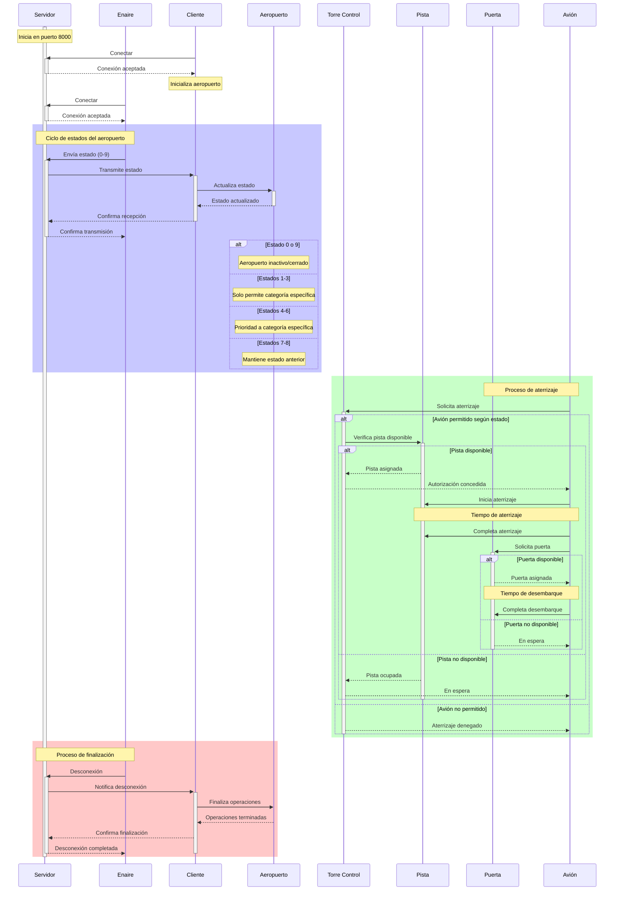

```mermaid
sequenceDiagram
    participant S as Servidor
    participant E as Enaire
    participant C as Cliente
    participant A as Aeropuerto
    participant TC as Torre Control
    participant P as Pista
    participant PR as Puerta
    participant AV as Avión

    %% Inicio del sistema
    activate S
    Note over S: Inicia en puerto 8000
    
    %% Conexión del cliente
    C->>+S: Conectar
    S-->>-C: Conexión aceptada
    Note over C: Inicializa aeropuerto

    %% Conexión de Enaire
    E->>+S: Conectar
    S-->>-E: Conexión aceptada
    
    %% Ciclo principal
    rect rgb(200, 200, 255)
        Note over E,S: Ciclo de estados del aeropuerto
        
        E->>+S: Envía estado (0-9)
        S->>+C: Transmite estado
        C->>+A: Actualiza estado
        A-->>-C: Estado actualizado
        C-->>-S: Confirma recepción
        S-->>-E: Confirma transmisión
        
        alt Estado 0 o 9
            Note over A: Aeropuerto inactivo/cerrado
        else Estados 1-3
            Note over A: Solo permite categoría específica
        else Estados 4-6
            Note over A: Prioridad a categoría específica
        else Estados 7-8
            Note over A: Mantiene estado anterior
        end
    end

    %% Proceso de aterrizaje
    rect rgb(200, 255, 200)
        Note over AV,PR: Proceso de aterrizaje

        AV->>+TC: Solicita aterrizaje
        
        alt Avión permitido según estado
            TC->>+P: Verifica pista disponible
            
            alt Pista disponible
                P-->>TC: Pista asignada
                TC-->>AV: Autorización concedida
                
                AV->>P: Inicia aterrizaje
                Note over AV,P: Tiempo de aterrizaje
                AV->>P: Completa aterrizaje
                
                AV->>+PR: Solicita puerta
                
                alt Puerta disponible
                    PR-->>AV: Puerta asignada
                    Note over AV,PR: Tiempo de desembarque
                    AV->>PR: Completa desembarque
                else Puerta no disponible
                    PR-->>AV: En espera
                end
                
                deactivate PR
            else Pista no disponible
                P-->>TC: Pista ocupada
                TC-->>AV: En espera
            end
            
            deactivate P
        else Avión no permitido
            TC-->>AV: Aterrizaje denegado
        end
        
        deactivate TC
    end

    %% Proceso de desconexión
    rect rgb(255, 200, 200)
        Note over E,S: Proceso de finalización
        
        E->>+S: Desconexión
        S->>+C: Notifica desconexión
        C->>A: Finaliza operaciones
        A-->>C: Operaciones terminadas
        C-->>S: Confirma finalización
        S-->>E: Desconexión completada
        deactivate C
        deactivate S
    end

    deactivate S
```